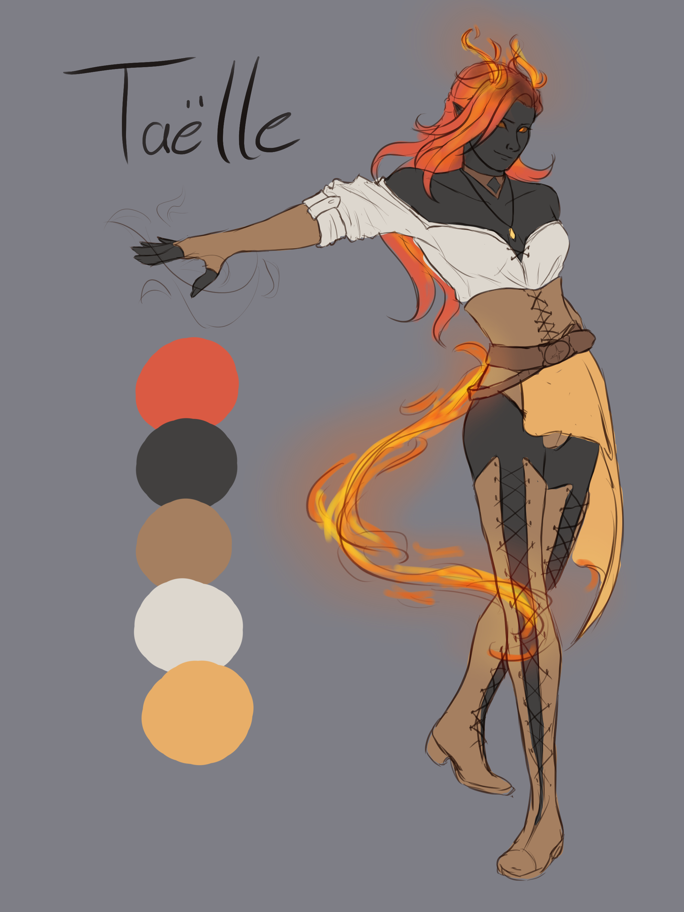
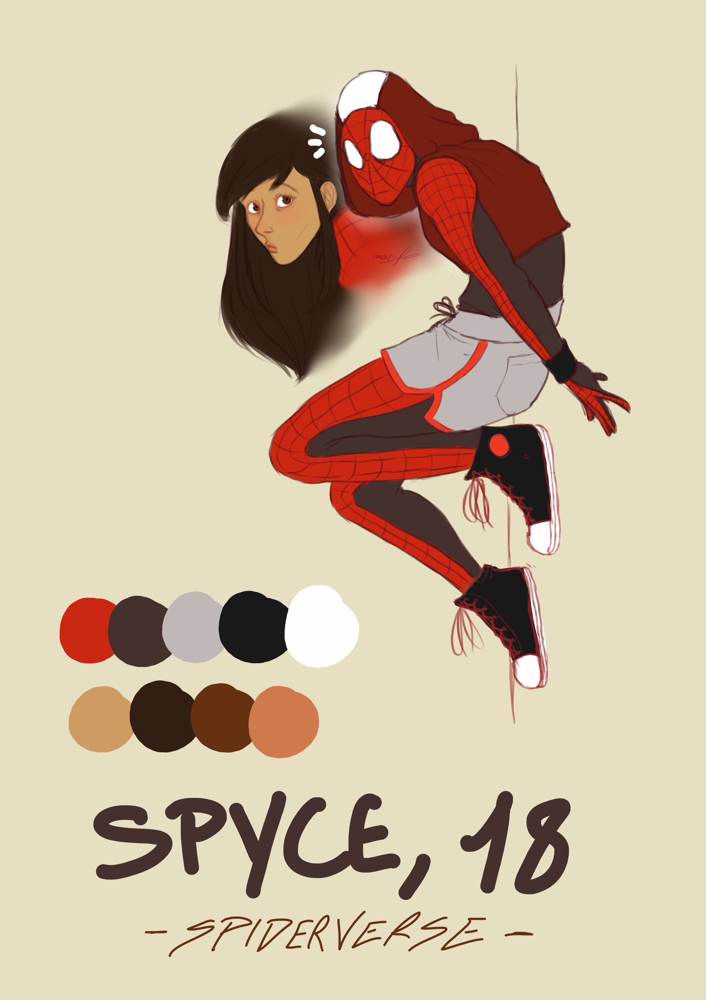
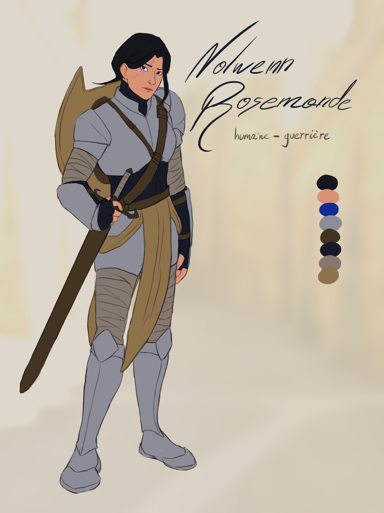
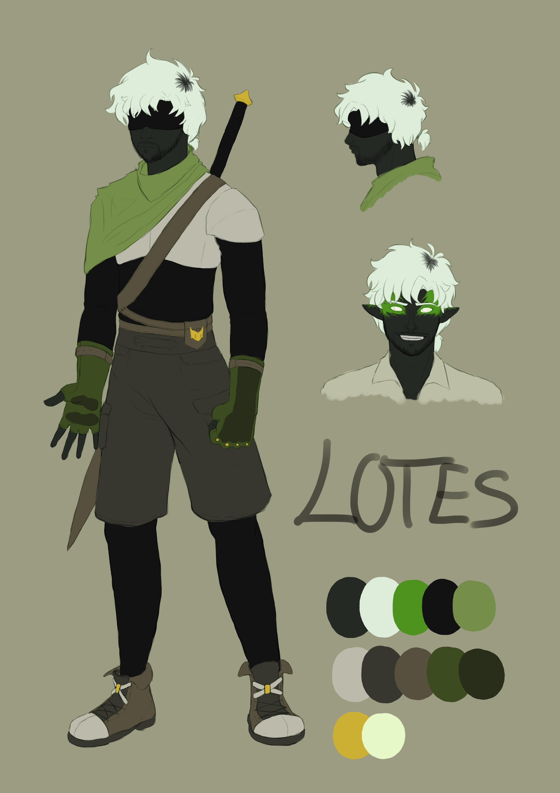
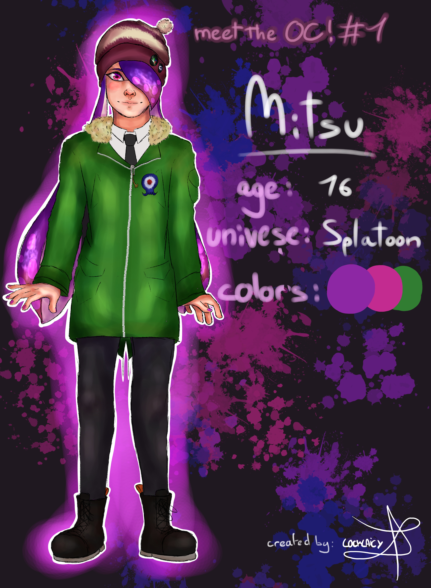

# Taëlle

>Taëlle, personnage inspiré de Dungeons & Dragons

# Spyce

>Spyce, personnage inspiré de Spider-man et du Spiderverse

# Nolwenn

>Nolwenn Rosemonde, personnage de Jeu de Rôle dans l'univers de Chroniques Oubliées Fantasy 2

# Lotes

>Lotes, personnage original de mon propre univers

# Lionna

>Lionna, personnage inspiré de Miraculous

# Mitsu

>Mitsu, personnage inspiré de Splatoon
